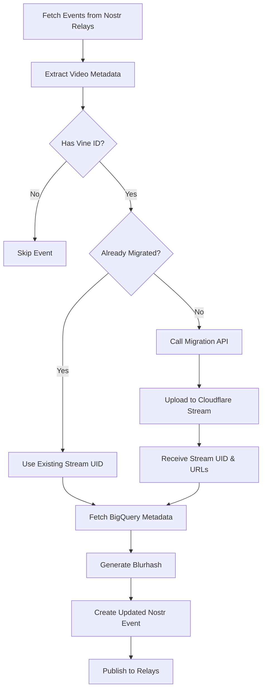

# Video Upload and Processing Architecture Documentation

## Overview

This document describes the current server setup for uploading Vine videos to Cloudflare Stream and retrieving URLs and thumbnails. The system migrates videos from OpenVine storage to Cloudflare Stream, enriches metadata from BigQuery, and publishes events to Nostr relays.

## System Components

### 1. Cloudflare Stream Integration

#### Migration API Endpoint
- **URL**: `https://cf-stream-service-prod.protestnet.workers.dev`
- **Authentication**: Bearer token authentication
- **Endpoint**: `/v1/openvine/migrate`

#### Migration Process
The system performs server-side migration of videos:
1. Takes an OpenVine video ID and Vine ID
2. Uploads video to Cloudflare Stream
3. Returns Stream UID and various URL formats
4. Handles video processing asynchronously

#### URL Formats Generated
After migration, videos are accessible via multiple formats:
- **HLS Streaming**: `https://cdn.divine.video/{stream_uid}/manifest/video.m3u8`
- **MP4 Download**: `https://cdn.divine.video/{stream_uid}/downloads/default.mp4`
- **DASH Streaming**: `https://cdn.divine.video/{stream_uid}/manifest/video.mpd`
- **Thumbnail**: `https://cdn.divine.video/{stream_uid}/thumbnails/thumbnail.jpg`
- **Animated Thumbnail**: `https://cdn.divine.video/{stream_uid}/thumbnails/thumbnail.gif`

### 2. BigQuery Data Source

#### Configuration
- **Project ID**: `openvine-co`
- **Dataset**: `vine_export`
- **Tables Used**:
  - `posts_with_archived_videos` - Contains Vine post metadata
  - `vine_posts` - Contains additional engagement metrics and timestamps

#### Data Schema
The BigQuery tables provide comprehensive Vine metadata:

```sql
SELECT DISTINCT
    p.vineId,                                    -- Unique Vine ID
    p.authorName as username,                    -- Original Vine username
    p.description,                                -- Video description/caption
    CAST(p.loops AS INT64) as loops,            -- View count
    p.like_count as likes,                       -- Like count
    CAST(vp.comment_count AS INT64) as comment_count,    -- Comments
    CAST(vp.repost_count AS INT64) as repost_count,      -- Reposts/revines
    UNIX_SECONDS(vp.created_at) as created_timestamp,    -- Original creation time
    ARRAY(                                       -- Extracted hashtags
        SELECT DISTINCT LOWER(REGEXP_EXTRACT(tag, r'#(\w+)'))
        FROM UNNEST(REGEXP_EXTRACT_ALL(p.description, r'#\w+')) as tag
    ) as hashtags
FROM posts_with_archived_videos p
LEFT JOIN vine_posts vp ON p.vineId = vp.id
```

#### Metadata Enrichment
BigQuery provides:
- Original Vine creation timestamps (crucial for historical accuracy)
- Complete engagement metrics (loops, likes, comments, reposts)
- Username associations
- Hashtag extraction from descriptions

### 3. Video Processing Pipeline

#### Concurrent Processing Architecture
The system uses multi-threaded concurrent processing:
- **Worker Threads**: Configurable (default: 3-5 workers)
- **API Rate Limiting**: Maximum 10-30 concurrent API calls
- **Semaphore Controls**: Separate limits for API calls and publishing

#### Processing Flow



### 4. Thumbnail Generation

#### Blurhash Generation
- Downloads thumbnail from Cloudflare Stream
- Resizes image to 32x32 pixels
- Generates 4x3 component blurhash
- Embeds in Nostr event for placeholder display

#### Thumbnail URLs
Each video has two thumbnail formats:
1. **Static Thumbnail**: `.jpg` format for preview
2. **Animated Thumbnail**: `.gif` format showing video preview

### 5. Nostr Event Structure

#### Event Kind
- **Kind 32222**: Video event (replaceable)

#### Required Tags
```json
{
  "tags": [
    ["d", "{vine_id}"],                          // Unique identifier
    ["title", "{title_or_description}"],         // Video title
    ["url", "{hls_url}"],                        // Primary streaming URL
    ["streaming", "{hls_url}", "hls"],          // HLS stream
    ["r", "{mp4_url}", "download"],             // Download link
    ["thumb", "{thumbnail_url}"],               // Thumbnail
    ["preview", "{animated_thumbnail_url}"],     // Animated preview
    ["vine_id", "{vine_id}"],                   // Original Vine ID
    ["stream_uid", "{cloudflare_stream_uid}"],  // CF Stream ID
    ["published_at", "{unix_timestamp}"],       // Original Vine timestamp
    ["loops", "{view_count}"],                  // View count
    ["likes", "{like_count}"],                  // Like count
    ["comments", "{comment_count}"],            // Comment count
    ["reposts", "{repost_count}"],              // Repost count
    ["username", "{original_username}"],        // Vine username
    ["t", "{hashtag}"],                         // Hashtags (multiple)
    ["client", "divine.video"],                 // Client identifier
    ["migration", "openvine-to-stream", "{uid}"] // Migration tracking
  ]
}
```

#### IMETA Tag Structure
The `imeta` tag provides comprehensive media metadata:
```
["imeta",
  "url {mp4_url}",           // Primary video URL
  "m video/mp4",             // Media type
  "dim 480x480",             // Dimensions
  "duration 6",              // Duration in seconds
  "blurhash {hash}",         // Placeholder image
  "image {thumbnail_url}",   // Thumbnail
  "fallback {hls_url}",      // Fallback streaming URL
  "fallback {dash_url}",     // Additional fallback
  "alt {description}"        // Accessibility text
]
```

## Database Schema

### SQLite Migration Database
**File**: `robust_migration.db`

#### user_migrations Table
```sql
CREATE TABLE user_migrations (
    username TEXT PRIMARY KEY,
    nostr_public_key TEXT,
    nostr_private_key TEXT,
    -- Additional user migration fields
);
```

### Progress Tracking
The system maintains JSON checkpoint files:
- `cf_stream_migration_progress.json` - Tracks migration progress
- `update_existing_progress.json` - Tracks metadata update progress

#### Checkpoint Structure
```json
{
  "processed_events": ["event_id_1", "event_id_2"],
  "migrated_videos": {
    "vine_id": "stream_uid"
  },
  "failed_migrations": {
    "vine_id": {
      "error": "error_message",
      "timestamp": "ISO_timestamp"
    }
  },
  "republished_events": ["event_id_1", "event_id_2"],
  "stats": {
    "events_checked": 0,
    "videos_migrated": 0,
    "videos_republished": 0,
    "failed_migrations": 0,
    "start_time": "ISO_timestamp",
    "last_checkpoint": "ISO_timestamp"
  }
}
```

## Error Handling and Retry Logic

### API Retry Strategy
- **Max Retries**: 5 attempts
- **Backoff**: Exponential (2, 4, 8, 16, 32 seconds)
- **Timeout**: 60 seconds per request
- **Rate Limiting**: 429 responses trigger longer delays

### Error Categories
1. **Recoverable Errors** (retry):
   - Network timeouts
   - 5xx server errors
   - Rate limiting (429)
   - Connection errors

2. **Non-Recoverable Errors** (skip):
   - 4xx client errors (except 429)
   - Missing video files
   - Invalid video IDs

## Performance Metrics

### Processing Rates
- **Event Processing**: ~2-5 events/second
- **Batch Size**: 500 events per fetch
- **Checkpoint Frequency**: Every 25-100 events

### Concurrency Limits
- **Worker Threads**: 3-5 concurrent
- **API Calls**: 10-30 concurrent maximum
- **Publishing**: 6-10 concurrent maximum

## Monitoring and Logging

### Log Files
- **Main Log**: `cf_stream_migration_concurrent_{timestamp}.log`
- **Monitor Log**: `cf_stream_monitor_{timestamp}.log`
- **Update Log**: `update_existing_bigquery_{timestamp}.log`

### Monitor Log Format
```
MIGRATED,{vine_id},{stream_uid},{hls_url},{mp4_url}
REPUBLISHED,{event_id},{vine_id},{stream_uid},{hls_url},{mp4_url}
```

## Configuration

### Environment Variables
```bash
# Cloudflare Stream API
CF_STREAM_MIGRATION_API=https://cf-stream-service-prod.protestnet.workers.dev
CF_STREAM_MIGRATION_TOKEN=your_token_here

# BigQuery Configuration
BIGQUERY_PROJECT_ID=openvine-co
BIGQUERY_DATASET_ID=vine_export
GCP_CREDENTIALS_FILE=/path/to/credentials.json

# Database
MIGRATION_DB=robust_migration.db
```

### Command Line Options
```bash
# Basic migration
python migrate_to_cf_stream_concurrent.py

# With options
python migrate_to_cf_stream_concurrent.py \
  --workers 5 \              # Number of concurrent workers
  --api-limit 20 \           # Max concurrent API calls
  --force-remigrate \        # Re-migrate already processed videos
  --test                     # Test mode (process only first batch)
```

## Migration Scripts

### 1. migrate_to_cf_stream_concurrent.py
**Purpose**: Main migration script with concurrent processing
- Fetches events from Nostr relays
- Migrates videos to Cloudflare Stream
- Enriches with BigQuery metadata
- Publishes updated events

### 2. update_existing_with_bigquery.py
**Purpose**: Updates already-migrated videos with BigQuery metadata
- Targets videos with Stream UIDs but missing timestamps
- Adds original Vine timestamps and engagement metrics
- Preserves existing Stream URLs

### 3. migrate_to_cf_stream_with_bigquery.py
**Purpose**: Combined migration with immediate BigQuery enrichment
- Performs migration and enrichment in single pass
- Optimized for new migrations
- Includes comprehensive metadata from start

## Best Practices

### Deployment Recommendations
1. Start with small test batches using `--test` flag
2. Monitor logs for error patterns
3. Use checkpoint files for resumable processing
4. Adjust worker counts based on server capacity
5. Implement rate limiting to avoid API throttling

### Data Integrity
1. Always preserve original Vine IDs
2. Maintain original creation timestamps
3. Keep engagement metrics accurate
4. Verify Stream URLs before publishing
5. Use atomic operations for database updates

### Performance Optimization
1. Batch BigQuery queries when possible
2. Cache frequently accessed metadata
3. Use connection pooling for database access
4. Implement progressive backoff for retries
5. Monitor memory usage with large batches

## Troubleshooting

### Common Issues

#### 1. Rate Limiting
**Symptom**: 429 responses from API
**Solution**: Reduce `--api-limit` parameter

#### 2. Memory Issues
**Symptom**: Process killed or hanging
**Solution**: Reduce batch size or worker count

#### 3. Missing BigQuery Data
**Symptom**: No timestamps in published events
**Solution**: Verify BigQuery credentials and table access

#### 4. Failed Publications
**Symptom**: Events not appearing on relays
**Solution**: Check relay connectivity and user keys

### Debug Commands
```bash
# Check migration progress
cat cf_stream_migration_progress.json | jq '.stats'

# View recent failures
grep "FAILED" cf_stream_monitor_*.log | tail -20

# Count migrated videos
cat cf_stream_migration_progress.json | jq '.migrated_videos | length'

# Check specific vine_id status
grep "vine_id_here" cf_stream_migration_concurrent_*.log
```

## Security Considerations

1. **API Tokens**: Store securely, never commit to repository
2. **Private Keys**: Encrypted storage recommended
3. **Database Access**: Restrict file permissions
4. **BigQuery Credentials**: Use service accounts with minimal permissions
5. **Relay Authentication**: Use NIP-42 authentication where supported

## Future Enhancements

### Planned Improvements
1. Implement webhook notifications for completed migrations
2. Add support for batch BigQuery queries
3. Implement distributed processing across multiple servers
4. Add real-time progress dashboard
5. Support for additional video formats and resolutions

### Scalability Considerations
1. Implement Redis for distributed locking
2. Use message queue for job distribution
3. Add horizontal scaling capabilities
4. Implement CDN cache warming
5. Add automated failover mechanisms